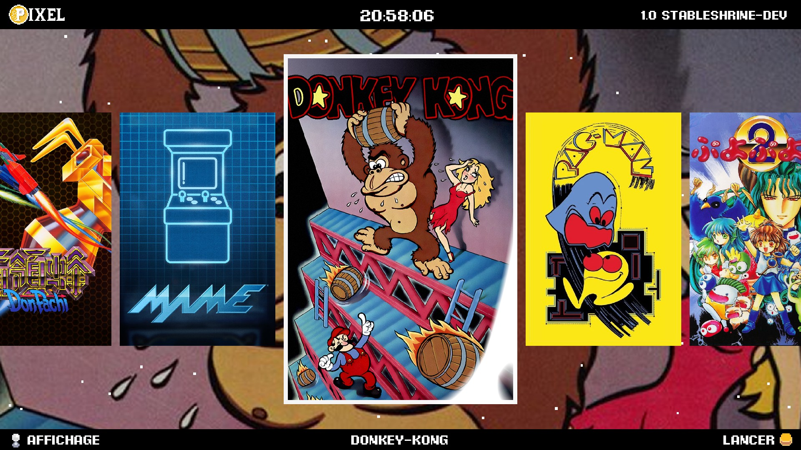

# The Pixel Arcade Launcher (PAL)

**The Pixel Arcade Launcher (PAL) is a lightweight and customizable arcade machine launcher built using Godot Engine (v4.3). It is designed to provide a seamless and attractive interface for accessing and launching games on an arcade setup.**

## Features

- 🖌️ **Customizable UI**: Modular and themable design
- 💾 **Library Management** : Install and uninstall games easily
- 🐧 **Platform-Agnostic** : Works both on Windows and Linux
- ⚡ **Fast and Lightweight** : Minimal overhead for quick game launching.
- ✨ **Animations and effects** : Gives a modern feel to the launcher.

## Requirements

- System running Windows, Linux, or another platform supported by Godot.
- At least 2 GB of RAM (more recommended for higher-end games).
- A graphics card that supports OpenGL 3.3 or higher.

## License

This project is licensed under the MIT License. See the LICENSE file for details.
